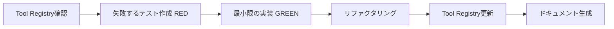

# TDD for MCP Tool Development

## 概要

MCPツール開発にテスト駆動開発(TDD)を統合し、品質と保守性を向上させます。

## 🎯 TDD統合の目的

1. **品質保証**: 新規ツールが仕様通りに動作することを保証
2. **リグレッション防止**: 既存ツールの変更が他に影響しないことを確認
3. **ドキュメント化**: テストコードが実行可能な仕様書として機能
4. **リファクタリング支援**: 安心してコード改善ができる

## 📋 TDD開発フロー

### 標準フロー: Red → Green → Refactor



### 詳細ステップ

#### Step 0: 重複チェック（事前）

```bash
# Claude Code で実行
/tool-check 要求のステータスを一括変更したい
```

#### Step 1: 失敗するテストを書く（RED）

**ファイル**: `tests/tools/batch-update-requirements.test.ts`

```typescript
import { describe, it, expect, beforeEach } from 'vitest';
import { RequirementsMCPServer } from '../../src/index.js';
import { RequirementsStorage } from '../../src/storage.js';

describe('batch_update_requirements tool', () => {
  let server: RequirementsMCPServer;
  let storage: RequirementsStorage;

  beforeEach(async () => {
    storage = new RequirementsStorage('./test-data');
    await storage.initialize();
    server = new RequirementsMCPServer();
  });

  it('should update multiple requirements status', async () => {
    // Arrange: テストデータ準備
    await storage.addRequirement({
      title: 'Requirement 1',
      description: 'Test',
      priority: 'low',
      category: 'test',
      status: 'draft',
      type: 'system'
    });
    await storage.addRequirement({
      title: 'Requirement 2',
      description: 'Test',
      priority: 'low',
      category: 'test',
      status: 'draft',
      type: 'system'
    });

    // Act: ツール実行
    const result = await server.callTool('batch_update_requirements', {
      filter: { status: 'draft', priority: 'low' },
      updates: { status: 'approved' }
    });

    // Assert: 期待する結果
    expect(result.totalFound).toBe(2);
    expect(result.updated).toBe(2);
    expect(result.failed).toBe(0);

    // 実際に更新されたことを確認
    const reqs = await storage.searchRequirements({ status: 'approved' });
    expect(reqs).toHaveLength(2);
  });

  it('should return error summary when some updates fail', async () => {
    // 失敗ケースのテスト
    const result = await server.callTool('batch_update_requirements', {
      filter: { status: 'nonexistent' },
      updates: { status: 'approved' }
    });

    expect(result.totalFound).toBe(0);
    expect(result.updated).toBe(0);
  });

  it('should validate before update when validateBefore is true', async () => {
    // バリデーション機能のテスト
    await storage.addRequirement({
      title: 'Invalid Requirement',
      description: 'Too short',
      priority: 'low',
      category: 'test',
      status: 'draft',
      type: 'system'
    });

    const result = await server.callTool('batch_update_requirements', {
      filter: { status: 'draft' },
      updates: { status: 'approved' },
      validateBefore: true
    });

    // バリデーションエラーで更新が止まることを確認
    expect(result.failed).toBeGreaterThan(0);
    expect(result.errors).toHaveLength(result.failed);
  });

  it('should not update any requirement if dryRun is true', async () => {
    await storage.addRequirement({
      title: 'Requirement 1',
      description: 'Test',
      priority: 'low',
      category: 'test',
      status: 'draft',
      type: 'system'
    });

    const result = await server.callTool('batch_update_requirements', {
      filter: { status: 'draft' },
      updates: { status: 'approved' },
      dryRun: true
    });

    expect(result.totalFound).toBe(1);
    expect(result.updated).toBe(0); // dry runなので実際には更新しない

    // ステータスが変わっていないことを確認
    const req = await storage.searchRequirements({ status: 'draft' });
    expect(req).toHaveLength(1);
  });
});
```

**この段階では実装がないため、テストは全て失敗します（RED）。**

```bash
npm test
# ❌ batch_update_requirements tool › should update multiple requirements status
# Error: Unknown tool: batch_update_requirements
```

#### Step 2: Tool Registry に登録

```bash
npm run register-tool -- batch_update_requirements --category crud
```

Tool Registry が更新され、以下の情報が追加されます:

```json
{
  "batch_update_requirements": {
    "name": "batch_update_requirements",
    "category": "crud",
    "version": "1.0.0",
    "status": "draft",
    "description": "複数の要求を一括で更新",
    "useCases": ["ステータス一括変更", "優先度一括変更"],
    "inputs": ["filter", "updates", "validateBefore?", "dryRun?"],
    "outputs": ["BatchUpdateResult"],
    "relatedTools": ["search_requirements", "update_requirement", "validate_requirement"]
  }
}
```

#### Step 3: 最小限の実装（GREEN）

**ファイル**: `src/index.ts`

```typescript
// CallToolRequestHandler に追加
case 'batch_update_requirements':
  return await this.handleBatchUpdateRequirements(args);

// メソッド実装
private async handleBatchUpdateRequirements(args: any): Promise<any> {
  const { filter = {}, updates = {}, validateBefore = false, dryRun = false } = args;

  // Step 1: 対象要求を検索
  const requirements = await this.storage.searchRequirements(filter);
  const totalFound = requirements.length;

  if (dryRun) {
    return {
      content: [{
        type: 'text' as const,
        text: JSON.stringify({
          totalFound,
          updated: 0,
          failed: 0,
          errors: [],
          dryRun: true,
          message: `${totalFound} requirements would be updated`
        }, null, 2)
      }]
    };
  }

  // Step 2: 各要求を更新
  const results = { updated: 0, failed: 0, errors: [] as any[] };

  for (const req of requirements) {
    try {
      // バリデーション（オプション）
      if (validateBefore && this.validationEngine) {
        const validationResult = await this.validationEngine.validate(
          req.id,
          new Map([[req.id, req]])
        );
        if (!validationResult.passed) {
          throw new Error(`Validation failed: ${validationResult.violations[0]?.message}`);
        }
      }

      // 更新実行
      await this.storage.updateRequirement(req.id, updates);
      results.updated++;
    } catch (error: any) {
      results.failed++;
      results.errors.push({
        id: req.id,
        error: error.message
      });
    }
  }

  return {
    content: [{
      type: 'text' as const,
      text: JSON.stringify({
        totalFound,
        ...results,
        updatedIds: requirements.slice(0, results.updated).map(r => r.id)
      }, null, 2)
    }]
  };
}
```

#### Step 4: テスト実行（GREEN確認）

```bash
npm test
# ✅ batch_update_requirements tool › should update multiple requirements status
# ✅ batch_update_requirements tool › should return error summary when some updates fail
# ✅ batch_update_requirements tool › should validate before update when validateBefore is true
# ✅ batch_update_requirements tool › should not update any requirement if dryRun is true
```

**全てのテストが通ったら GREEN 達成！**

#### Step 5: リファクタリング

コードをより良い構造に改善:

```typescript
// 専用のBatchToolsクラスに移動
private async handleBatchUpdateRequirements(args: any): Promise<any> {
  if (!this.batchTools) {
    throw new Error('BatchTools not initialized');
  }

  const result = await this.batchTools.batchUpdate(args);
  return {
    content: [{
      type: 'text' as const,
      text: JSON.stringify(result, null, 2)
    }]
  };
}
```

**リファクタリング後も再度テストを実行**:

```bash
npm test
# ✅ All tests still pass
```

#### Step 6: Tool Registry を更新（status: stable）

```typescript
// scripts/update-tool-status.ts を実行
npm run update-tool-status -- batch_update_requirements --status stable
```

または手動で `config/tool-registry.json` を更新:

```json
{
  "batch_update_requirements": {
    "status": "stable", // draft → stable
    "version": "1.0.0"
  }
}
```

#### Step 7: ドキュメント・使用例を追加

```bash
# 自動生成スクリプト（Phase 1.1実装後）
npm run generate-tool-docs
```

**手動の場合**:

`examples/batch_update_requirements.json`:

```json
{
  "tool": "batch_update_requirements",
  "description": "draft状態の低優先度要求を一括でrejectedに変更",
  "input": {
    "filter": {
      "status": "draft",
      "priority": "low"
    },
    "updates": {
      "status": "rejected"
    },
    "validateBefore": false,
    "dryRun": false
  },
  "expectedOutput": {
    "totalFound": 5,
    "updated": 5,
    "failed": 0,
    "errors": [],
    "updatedIds": ["REQ-001", "REQ-002", "REQ-003", "REQ-004", "REQ-005"]
  }
}
```

## 🧪 テスト構造

### テストディレクトリ構成

```
tests/
├── tools/                          # ツールごとのテスト
│   ├── add-requirement.test.ts
│   ├── update-requirement.test.ts
│   ├── batch-update-requirements.test.ts
│   └── ...
├── integration/                    # 統合テスト
│   ├── tool-workflow.test.ts      # ツール連携テスト
│   └── registry-consistency.test.ts
├── utils/                          # テストユーティリティ
│   ├── test-data-factory.ts       # テストデータ生成
│   └── mock-storage.ts            # モックストレージ
└── fixtures/                       # テストフィクスチャ
    └── sample-requirements.json
```

### テストテンプレート

**ファイル**: `tests/templates/tool-test.template.ts`

```typescript
import { describe, it, expect, beforeEach, afterEach } from 'vitest';
import { RequirementsMCPServer } from '../../src/index.js';
import { RequirementsStorage } from '../../src/storage.js';

describe('{{TOOL_NAME}} tool', () => {
  let server: RequirementsMCPServer;
  let storage: RequirementsStorage;

  beforeEach(async () => {
    storage = new RequirementsStorage('./test-data');
    await storage.initialize();
    server = new RequirementsMCPServer();
  });

  afterEach(async () => {
    // クリーンアップ
  });

  describe('正常系', () => {
    it('should {{SUCCESS_CASE_DESCRIPTION}}', async () => {
      // Arrange

      // Act
      const result = await server.callTool('{{TOOL_NAME}}', {
        // parameters
      });

      // Assert
      expect(result).toBeDefined();
    });
  });

  describe('異常系', () => {
    it('should handle invalid input', async () => {
      // エラーハンドリングのテスト
    });

    it('should handle missing required parameters', async () => {
      // 必須パラメータ欠如のテスト
    });
  });

  describe('エッジケース', () => {
    it('should handle empty result set', async () => {
      // 空の結果セットのテスト
    });

    it('should handle large data sets', async () => {
      // 大量データのテスト
    });
  });
});
```

### テスト自動生成スクリプト

**ファイル**: `scripts/generate-tool-test.ts`

```typescript
/**
 * Tool Registry から自動的にテストテンプレートを生成
 */
import fs from 'fs/promises';
import path from 'path';

async function generateToolTest(toolName: string) {
  const registry = JSON.parse(
    await fs.readFile('config/tool-registry.json', 'utf-8')
  );

  const tool = registry.tools[toolName];
  if (!tool) {
    throw new Error(`Tool ${toolName} not found in registry`);
  }

  // テンプレート読み込み
  const template = await fs.readFile(
    'tests/templates/tool-test.template.ts',
    'utf-8'
  );

  // プレースホルダー置換
  const testCode = template
    .replace(/{{TOOL_NAME}}/g, toolName)
    .replace(/{{SUCCESS_CASE_DESCRIPTION}}/g, tool.useCases[0] || 'perform operation successfully');

  // テストファイル出力
  const testPath = `tests/tools/${toolName.replace(/_/g, '-')}.test.ts`;
  await fs.writeFile(testPath, testCode);

  console.log(`✅ Generated test: ${testPath}`);
}

// CLI
const toolName = process.argv[2];
if (!toolName) {
  console.error('Usage: npm run generate-tool-test -- <tool-name>');
  process.exit(1);
}

generateToolTest(toolName);
```

## 🔄 TDD統合ワークフロー

### 新規ツール追加の完全フロー

```bash
# 1. 重複チェック
/tool-check 要求のステータスを一括変更したい

# 2. Tool Registry に仮登録
npm run register-tool -- batch_update_requirements --category crud

# 3. テスト自動生成
npm run generate-tool-test -- batch_update_requirements

# 4. テストケース編集（RED）
# tests/tools/batch-update-requirements.test.ts を編集

# 5. テスト実行（失敗確認）
npm test

# 6. 実装（GREEN）
# src/index.ts に実装を追加

# 7. テスト実行（成功確認）
npm test

# 8. リファクタリング
# コード改善

# 9. テスト再実行
npm test

# 10. Tool Registry 更新（stable）
npm run update-tool-status -- batch_update_requirements --status stable

# 11. ドキュメント生成
npm run generate-tool-docs

# 12. カバレッジ確認
npm run test:coverage
```

## 📊 品質基準

### テストカバレッジ目標

- **全体**: 80%+
- **新規ツール**: 90%+
- **Critical Path**: 100%

### テストの種類と割合

```
Unit Tests (70%):
  - 各ツールの単体テスト
  - 入力バリデーション
  - エラーハンドリング

Integration Tests (20%):
  - ツール間連携
  - Storage との統合
  - ValidationEngine との統合

E2E Tests (10%):
  - MCP プロトコル経由の実行
  - Claude Code からの呼び出し
```

## 🎯 CI/CD統合

### GitHub Actions ワークフロー

**ファイル**: `.github/workflows/tool-quality-check.yml`

```yaml
name: Tool Quality Check

on:
  pull_request:
    paths:
      - 'src/index.ts'
      - 'src/tools/**'
      - 'tests/tools/**'
      - 'config/tool-registry.json'

jobs:
  test-and-coverage:
    runs-on: ubuntu-latest
    steps:
      - uses: actions/checkout@v4
      - uses: actions/setup-node@v4
        with:
          node-version: '22'

      - name: Install dependencies
        run: npm ci

      - name: Run tests
        run: npm test

      - name: Check coverage
        run: npm run test:coverage

      - name: Validate Tool Registry
        run: npm run validate-registry

      - name: Comment PR with coverage
        uses: actions/github-script@v7
        with:
          script: |
            // カバレッジレポートをPRにコメント

  registry-consistency:
    runs-on: ubuntu-latest
    steps:
      - uses: actions/checkout@v4

      - name: Check Registry Consistency
        run: |
          # 全ツールがsrc/index.tsに実装されているか
          # 全ツールにテストが存在するか
          npm run check-registry-consistency

      - name: Fail if inconsistent
        if: steps.check.outputs.consistent == 'false'
        run: exit 1
```

### Pre-commit Hook

**ファイル**: `.husky/pre-commit`

```bash
#!/bin/sh
. "$(dirname "$0")/_/husky.sh"

# テスト実行
npm test

# カバレッジチェック
npm run test:coverage -- --reporter=json > coverage-summary.json

# 80%未満ならコミット拒否
COVERAGE=$(node -e "console.log(require('./coverage-summary.json').total.lines.pct)")
if (( $(echo "$COVERAGE < 80" | bc -l) )); then
  echo "❌ Test coverage is below 80% ($COVERAGE%)"
  exit 1
fi

echo "✅ Tests passed with $COVERAGE% coverage"
```

## 📝 package.json 更新

```json
{
  "scripts": {
    "test": "vitest run",
    "test:watch": "vitest",
    "test:coverage": "vitest run --coverage",
    "test:ui": "vitest --ui",
    "generate-tool-test": "tsx scripts/generate-tool-test.ts",
    "update-tool-status": "tsx scripts/update-tool-status.ts",
    "validate-registry": "tsx scripts/validate-registry.ts",
    "check-registry-consistency": "tsx scripts/check-registry-consistency.ts"
  }
}
```

## 🎓 ベストプラクティス

### 1. テストファースト

```typescript
// ❌ Bad: 実装してからテスト
1. 実装を書く
2. テストを書く
3. バグを見つける

// ✅ Good: テストしてから実装
1. テストを書く（RED）
2. 実装を書く（GREEN）
3. リファクタリング
```

### 2. 明確なテストケース

```typescript
// ❌ Bad
it('should work', async () => {
  const result = await callTool();
  expect(result).toBeTruthy();
});

// ✅ Good
it('should update status from draft to approved for all matching requirements', async () => {
  // Arrange: 3つのdraft要求を作成
  const draftReqs = await createDraftRequirements(3);

  // Act: ステータスを一括更新
  const result = await batchUpdateStatus('draft', 'approved');

  // Assert: 3つ全てが更新されたことを確認
  expect(result.updated).toBe(3);
  const approvedReqs = await getRequirementsByStatus('approved');
  expect(approvedReqs).toHaveLength(3);
});
```

### 3. テストの独立性

```typescript
// ❌ Bad: テスト間で状態を共有
let sharedStorage: Storage;

beforeAll(() => {
  sharedStorage = new Storage();
});

it('test 1', () => {
  sharedStorage.add('item1'); // 次のテストに影響
});

it('test 2', () => {
  expect(sharedStorage.count()).toBe(0); // test 1 の影響で失敗
});

// ✅ Good: 各テストで独立した状態
beforeEach(() => {
  storage = new Storage(); // 毎回新規作成
});

afterEach(() => {
  storage.clear(); // クリーンアップ
});
```

## 📈 メトリクス追跡

Tool Registry に品質メトリクスを追加:

```json
{
  "batch_update_requirements": {
    "quality": {
      "testCoverage": 95,
      "complexityscore": "low",
      "maintainabilityIndex": 85,
      "lastTested": "2025-10-24",
      "testCount": 12,
      "bugCount": 0
    }
  }
}
```

## 🔗 関連ドキュメント

- [MCP-TOOL-MANAGEMENT.md](./MCP-TOOL-MANAGEMENT.md) - Tool Registry 設計
- [TOOL-MANAGEMENT-IMPLEMENTATION-PLAN.md](./TOOL-MANAGEMENT-IMPLEMENTATION-PLAN.md) - 実装計画
- [Vitest Documentation](https://vitest.dev/) - テストフレームワーク

---

**Last Updated**: 2025-10-24
**Status**: TDD Framework Ready
